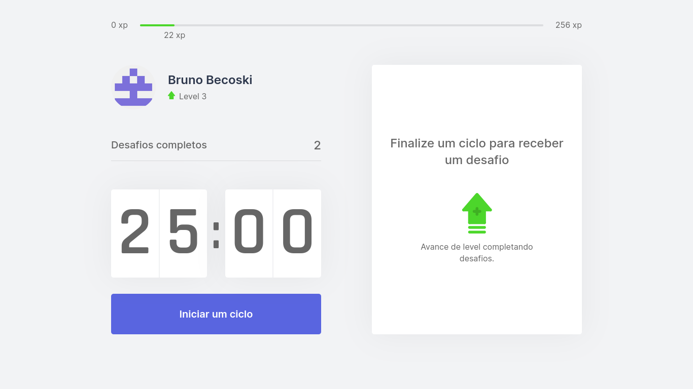

<h1 align="center">
    
</h1>

<p align="center">
  <a href="#-sobre">Sobre</a>&nbsp;&nbsp;&nbsp;|&nbsp;&nbsp;&nbsp;
  <a href="#-tecnologias">Tecnologias</a>&nbsp;&nbsp;&nbsp;|&nbsp;&nbsp;&nbsp;
  <a href="#-projeto">Projeto</a>&nbsp;&nbsp;&nbsp;|&nbsp;&nbsp;&nbsp;
  <a href="#-como-executar">Como executar</a>
</p> 

<p align="center">
  
</p>

## 📖 Sobre

Projeto construído durante a Next Level Week #04, na trilha de ReactJS da [Rocketseat](https://github.com/rocketseat-education/nlw-04-reactjs)

## ⚙ Tecnologias

Esse projeto foi desenvolvido com as seguintes tecnologias:

- [React](https://www.reactjs.org)
- [Next.js](https://www.nextjs.org)
- [TypeScript](https://www.typescriptlang.org)


## 💻 Projeto

O move.it é um app que une a técnica de Pomodoro com a realização de exercícios físicos para quem passa muito tempo na frente do computador.


## 🚀 Como executar

- Clone o repositório
```
git clone https://github.com/BrunoBecoski/NLW-4-MoveIt-ReactJS.git
```
- Instale as depêndencias
```
yarn install
```
- Inicie o servidor
``` 
yarn dev
```
- Acesse no seu navegador
```
http://localhost:3000
```
